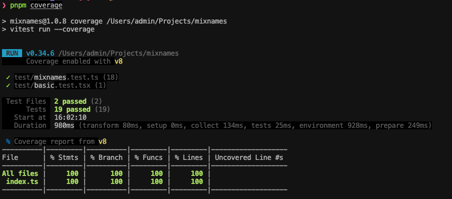

# mixnames

[](https://npmjs.org/package/mixnames)
[](https://npmjs.org/package/mixnames)

## Install

```sh
$ pnpm add mixnames
```
## Usage

```js
const mixnames = require('mixnames');

mixnames('foo', 'bar'); // => 'foo bar'
```

## Test

[test](./test/)



## LICENSE

MIT
